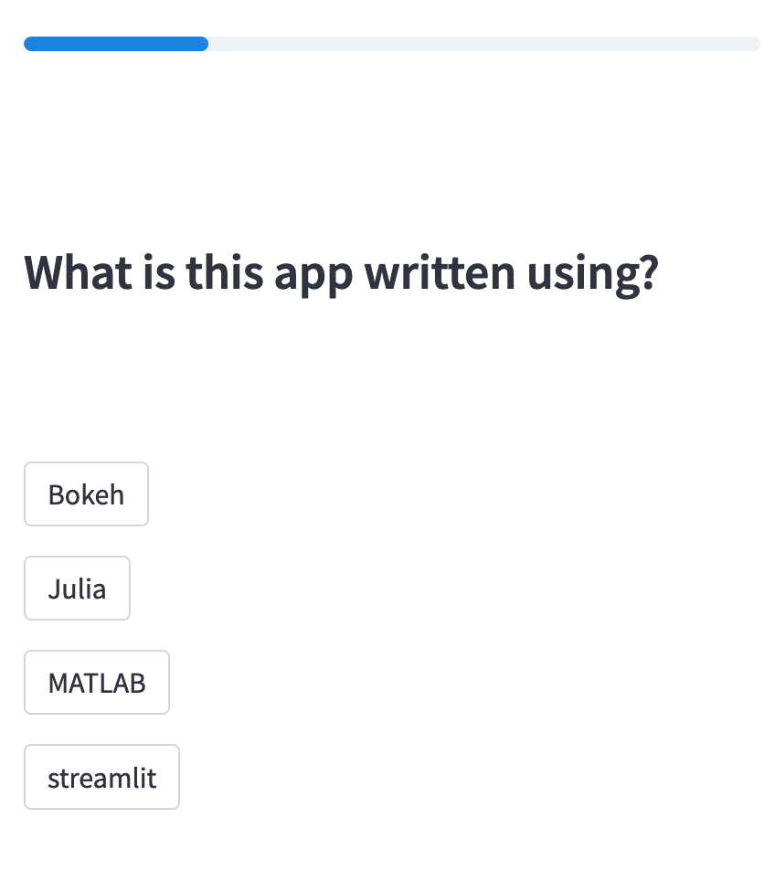

# streamlit-poll



This app allows you to easily set up a poll/quiz, and view results from that poll/quiz.

The best part is that you don't have to download or install anything -- it works entirely in the browser and you can use the live hosted version without writing new code or configuring anything. 

## Demo

[Click here for what this looks like](https://sg-s-streamlit-poll-poll-38kft7.streamlitapp.com/?poll_loc=https://raw.githubusercontent.com/sg-s/streamlit-poll/main/sample.poll&poll_name=demo)

## OK this looks nice, how do I use my own questions?

1. Write your questions in a pipe-separated text file. [Look at the sample questions](https://github.com/sg-s/streamlit-poll/blob/main/sample.poll) for formatting details. 
2. Upload this file somewhere (yeah, wherever you want)
3. Visit this link:

```
https://sg-s-streamlit-poll-poll-38kft7.streamlitapp.com/?poll_loc=$link_to_your_poll&poll_name=your_own_name)
```

That's it! Instant working poll. 

## What if I want to view results of the poll?

Simple, tack on `show_results=True` to the URL, as in:

```
https://sg-s-streamlit-poll-poll-38kft7.streamlitapp.com/?poll_loc=https://raw.githubusercontent.com/sg-s/streamlit-poll/main/sample.poll&poll_name=demo&show_results=True
```

or [click here](https://sg-s-streamlit-poll-poll-38kft7.streamlitapp.com/?poll_loc=https://raw.githubusercontent.com/sg-s/streamlit-poll/main/sample.poll&poll_name=demo&show_results=True)